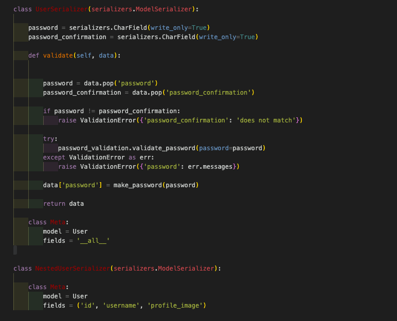
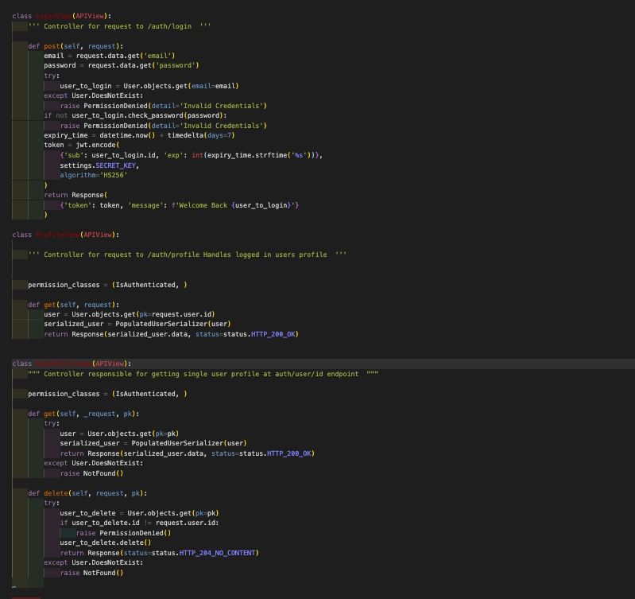
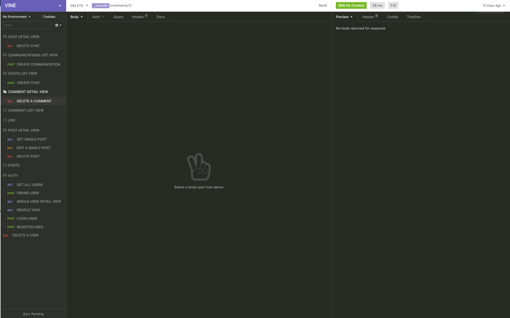
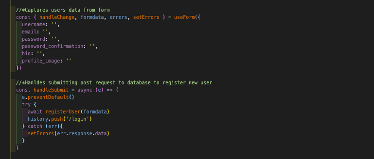
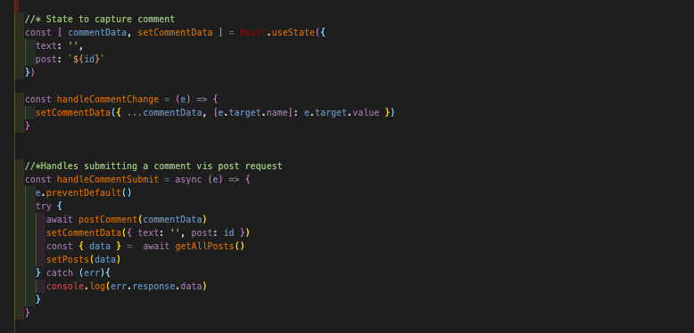
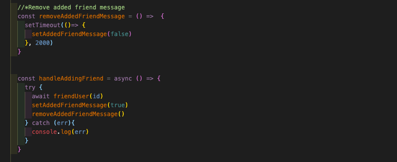

<h1>SEI-Project Four: DJango + React App</h1>

<h2>Project Brief</h2>

This was the fourth and final project I completed in General Assembly’s Immersive Software Engineering course. Project four was a solo coding project where I was tasked with building a full-stack application. Over a 7 day time period. The backend had to be a fully restful API built with Django using Django REST Framework to serve up the data from a PostgreSQL database. The front end of the application was to be built with React and could use any dependencies and CSS frameworks of my liking.

<h2>Technologies used</h2>
<ul>
<li>React JS</li>
<li>Framer Motion</li>
<li>React Spring</li>
<li>React Loader Spinner</li>
<li>Axios</li>
<li>Milligran CSS framework</li>
<li>Sass</li>
<li>JavaScript</li>
<li>Github</li>
<li>Insomnia</li>
<li>Django</li>
<li>Django REST framwork</li>
<li>Table Plus</li>
<li>Postgre SQL</li>
</ul>

<h2>The App: Vine</h2>

Vine is a social networking/blog application for gardeners. It allows a user to create a profile, makes posts, comment on another users post, like a post, view others users profiles, view a detailed break down of there own activity on the site and chat with other users.

You can find a live version of the app here: [Vine](https://vine-social-network.herokuapp.com/)

<h3>How to use the App</h3>

<ol>
<li>When a user first lands on the app they are taken to the home page that plays a short animation on loading. From here a user is given one of two choices in the navigation bar. To log in if they already have an account or register if they are a new user.</li>

#   

<li>If a user does not have an account they would click the register button and are taken to register page where they need to provide a username, email, password, password confirmation, a short bio and profile photo. If a user leaves any of the fields blank and tries to submit the form they will receive an error message underneath the field that has not been filled in correctly. If the registration was successful the user is pushed to the login page.</li>

#   

<li>When the user lands on the login page they will need to provide the email and password they used in the registration process. If the user provides incorrect details or an empty field and tries to submit the form they will receive an error. If the correct details are provided the user will be taken to the feed page. </li>

#   

<li>When the user lands on the feed page they can firstly scroll through posts and comments made by other users of the site. If a user wants to comment on a post they use the comment field at the bottom of each post. Here they can also like a users post. Next a user can create there own post my navigating to the top of the page and began by entering text in the text field, ‘Write your post here….’.  The user then chooses an image to accompany the post and clicks create post. The users post will then appear at the top of the posts on the feed page. If a user clicks on  another users profile photo they will be taken to the said users profile.</li>

#  
#  

<li>Once landing on another users profile the user will be able to see a username, email, date the user joined, bio, friends of the user and lastly is a button that will let the user add the user who’s profile they are own as a friend.</li>

#  

<li>At this point a user can navigate to their own profile by clicking the ‘profile’ button in the nav bar. The profile profile view is only visible to the user who is logged in to the site. Here the user can see their username, email, date they joined, bio, friends list, posts they have created, posts they have liked and comments they have made. At the bottom of the page is a delete profile button, if a user clicks the delete button there profile will be deleted and they will be pushed to the homepage.</li>

#  
#  
#  

<li>A user also has the option to directly message any other users of the site. This can be done by clicking the open chat button at the bottom left of the page. From here the user selects the person they would like to chat with from the select menu and a chat box will appear to the right of the select menu. The user can then enter text in the message text field and click send. A user can create as many chats as they would like but they cannot start a chat with own profile. If a user started the chat they are able to delete the chat by clicking the delete button located at the button of each chat box.</li>

#  

<li>Lastly a user can logout of there profile by clicking the logout button located in the navigation bar and the user will be pushed to the home page.</li>

<h2>Creating the app</h2>

Once settled on a well rounded concept that would be achievable in the time frame but at the same time push me out of my comfort zone. I began the planning phase. Normally I would create wireframes and mind maps to help plan the flow and look of the website. However this time I took a different approach. I knew that I wanted to use a new CSS framework called, ‘Milligram’ but at this point hadn’t experimented with the framework. So instead of using wireframes and mind maps to plan the front-end of the website I built a dummy react application of how I would potentially like the site to look. I used this as the starting point when I built the front end. Below is a screenshot of the profile page from the dummy application.

#  

To plan the back end of the website I created an ERD diagram to plan the tables I would need in my database and have a visual representation of what relationships those tables would need for the site to function correctly.

#  

With a clear idea of how the back-end would function, I started off by creating a new project in Django, installed the pylint’ dependency and created a new ‘.pylintrc’ file. From there I moved onto setting up a new Postgres database, gave the database a name, ran initial migrations and tested the database by running on my local server. Next I created a super user and checked I could login into my database admin page on port 8000.

Once the bones of the database were up and running. I moved onto setting up my apps. Starting off by installing, ‘Django REST Framework’ and adding it to the list of installed apps in the ‘settings’ file. Then I moved onto creating the first app for handling the users of the website, titled ‘jwt_auth' and added it to the, ‘Installed Apps’ list in the settings file of the project folder. Then moved onto creating the model, with the model written I created a new folder inside the ‘jw.auth’ folder titled, ‘serializers’. Inside ‘serializers’ I made a new file titled common. The common serializer is responsible for creating a users password, making sure the password and password confirmation match and requiring the password to be at least 8 characters long containing one number. Then I created a new file inside the ‘jwt.auth’ folder called, ‘authentication.py’, installed the ‘pyjwt’ dependency and added it to the ‘Installed Apps’ list in ‘settings.py’. ‘authentication.py’ was responsible for checking if a user has a valid authentication token. Lastly I added the ‘authentication.py’ file to the ‘settings.py’ file as the default method for authenticating a user, added the ‘jwt.auth’ model to the admin file in the ‘jwt.auth folder’, migrated the ‘jwt.auth’ app to the database and checked in the ‘Table Plus’ to make sure the database reflected the changes.

The code snippet below is the 'common.py' serializer

#  

The next step was creating the views for a user that included views to register a user, log a user in, a profile view of the user that was currently logged in, a user list view, a detailed user view and user friend view that was used to add another user to users friend list. From there I created a new file titled ‘urls.py’ that was responsible  for handling all the user routes and  then added the user routes to the main ‘urls.py file’ in the projects folder. As I was creating each view and url I would make API requests in, ‘Insomnia’ to check the appropriate response was being received and if an error is encountered the correct error messaged is raised.

The code snippet below is the view for registering a user and logging a user in.

#  

The image below is the insomina workspace I used in my project

#  

I followed the same process to create the models, serialisers, and ulrs for the, posts, comments, chats and communications apps. Each app ended up having an additional file in their, ‘serializers’ folder titled ‘populated.py’ that was responsible for showing nested information on the response object in an API request.

With the back-end working correctly I moved to creating the front of the website. Making a new React application. Then created a, ‘components’ folder in the, ‘src’ folder. Inside the components folder I created a ‘Home’, ‘Nav’, ‘Register’ and ‘Login’ component. Added a basic structure to each component and imported each component to ‘App.js’. From here I built the routing for the website using ‘react-router-dom’ and moved onto making the navigation bar. With the navigation bar up and running I began working on the ‘Register’ component that involved making a custom hook to capture a users input and handle any errors. I reused the custom hook in the login page. Next I created a new folder titled, ‘lib', inside that a new file titled ‘api’ that would hold all the different API requests. In the API file I created a new POST request to handle registering a user. Next I moved to the login page and repeated the same process, however I also created a new file inside the, ‘lib’ folder titled ‘auth.js’ that was responsible for holding any functions that related to user authentication. Inside ‘auth.js’ I made a function called, ‘setToken’ that would store a users authentication token into local storage after they had logged in.

The the code snippet below are the functions used to register a new user.

#  

With user authentication done and dusted I moved on to creating the ‘PostIndex.js’ component that used a GET request to request all the posts made by users of the site. The data from the request was then mapped over and posts were passed into their own ‘PostCard’ component. Once I had all the user posts showing correctly I started working on the functionality that allowed a user to create a post. Reusing the custom hook to capture info from a user and making a new POST request in the, ‘api.js’ file. After that moving onto the post edit and delete functionality that would allow a user to edit or delete their post on the ‘Feed’ page instead of being moved to another page. For the edit function this involved making a GET request for the post information stored in the database. Using that information to pre-populate the form a user would edit. Then making a PUT request to save the changes. The delete function was a DELETE request using the post id to identify the correct post.

The the code snippet below are the functions used in creating a comment

#  

The next step was creating the commenting and liking functionality. Both involved making a post request to the database, but the comment had the extra functionality that allowed a user to delete any comments they had made. The last piece of functionality on the feed page was adding a link from the photo of a user to their profile. I used a ‘react-router-dom’ link to link to the users profile and when a user lands on a users profile(User.js component) a React use effect was used to make a GET request for the users profile. In the ‘User.js’ component I added the functionality to add a user as a friend. Using an onclick to capture the id of the user who’s profile was being visited sending a post request to the current users profile and pushing the visited users details into the current users ‘friendedBy’ array.

The the code snippet below are the functions used to freind another user.

#  

From here I moved onto making the ‘Profile Component’ that was used to display the profile of the current user who is logged in. This involved making a GET request using the the token that had been previously stored in local storage for authentication. On this page I was able to show the user a detailed breakdown of there activity on the website using reverse relationships I had established when building the relationships between app models.

The last main piece of functionality was the chat functionality that would allow a user to directly message another user of the site. I started by creating a ‘footer’ component that would be present on every page when a user was logged in. Once the footer component was created I moved onto creating the chat. A user would start a chat and the messages between the two users would be stored in the chat, so a new chat would be created every time a user started chatting with a new user. I began by making a GET request to get all the users on the site. Passing the data into a select menu that user could choose a chat recipient from. I took the id of the user that was chosen in the select menu and sent a POST request to start the chat. Then used a GET request to get the profile of the user who was currently logged because the chat would exist in their profile under the 'createdChats’  array. From here I created a new component that would deal with sending messages from the user who started the chats point of view. Using a POST request to the ‘createdChats’ array  and then calling the same GET request for the current user to reflect each message on the screen as it was sent. Then I moved onto creating the functionality what would deal with displaying and replying to a messages from the message recipients point of view. Mapping over the ‘receivedChats’ array in the profile of the current user to display the messages. Then sending a new POST request back to the ‘createdChats’ array of the user who started the chat.

For the styling I used, 'Milligram' CSS framework for the forms and buttons. The remainder of the styling was built using Sass and Flexbox.

For the seeding data. I created 10 dummy profiles, 20 dummy posts and around 20 dummy comments.

<h2>Challenges</h2>

This was the first project where I had used python as a backend programming language. At the start of the project I found it a bit challenging switching between using python on the back-end and JavaScript on the front but found my groove after day 2.

Another aspect I found challenging was how to display the chat function on the front-end so a user could send a message to another user and the user that received the message could reply to the received message. This was challenging because the user who sent the first message would be the creator of the chat and the chat would be stored in the ‘createdChats’ array on the user object. However the user who received the chat would have the chat stored in the ‘recievedChats’ array in there user object but this user would still need to reply to the initial chat that was stored in the ‘createdChats’ array of the user who sent the first message.

<h2>Wins</h2>

The biggest win for me was definitely the implementation of the chat function. I found designing the models, ulrs and serializers really straightforward and it seemed to be running perfectly when I ran tests in insomnia. But when it came to implementing the feature on the front end it was a lot more challenging and I ran into a several problems I hadn’t accounted for. At one point I wasn’t sure I would be work it out. To get over this hurdle felt like a huge accomplishment and a nice progression in my skills as a developer.

The first piece of code below is the from my, ‘CreateadMessage’ component and the second piece of code is from my ‘RecievedMessage’ component. When a user sends a message it is stored in the chat that was created by the user who sent the first message. When a user receives a message they reply to the the same chat that was started by the user who sent the first message. In turn creating a seamless experience for a user.

The 1st code snippet below is the ‘CreatedMessage’ component the 2nd snippet is the ‘RecievedMessage’ component.

#  
#  

<h2>Learnings</h2>

With this being the biggest project I had undertaken by myself I found that planning and managing my time really keep me on track. Learning to value a well thought out plan that considered how to deal with potential issues before they came up.

<h2>Future Features</h2>

If I had more time in the future I would like to

<ul>
<li>If I had more time I would like to implement a poll feature. Where a user can pose a yes or no question and other users of the site could vote use yes or no to the question and have the results of the poll reflected on the feed page.</li>
</ul>