<h1>SEI-Project Four: DJango + React App</h1>

<h2>Project Brief</h2>

This was the fourth and final project I completed in General Assembly’s Immersive Software Engineering course. Project four was a solo coding project where I was tasked with building a full-stack application. Over a 7 day time period The backend had to be a fully restful API built with Django using Django REST Framework to serve up the data from a Postgres database. The front end of the application was to be built with React and could use any dependencies and CSS frameworks of my liking.

<h2>Technologies used</h2>
<ul>
<li>React JS</li>
<li>Framer Motion</li>
<li>React Spring</li>
<li>React Loader Spinner</li>
<li>Axios</li>
<li>Milligran CSS framework</li>
<li>Sass</li>
<li>JavaScript</li>
<li>Github</li>
<li>Insomnia</li>
<li>Django</li>
<li>Django REST framwork</li>
<li>Table Plus</li>
<li>Postgre SQL</li>
</ul>

<h2>The App: Vine</h2>

Vine is a social networking/blog application for gardeners. It allows a user to create a profile, makes posts, comment on another users post, like a post, view others users profiles, view a detailed break down of there own activity on the site and chat with other users.

You can find a live version of the app here: [Vine](https://vine-social-network.herokuapp.com/)

<h3>How to use the App</h3>

<ol>
<li>When a user first lands on the app they are taken to the home page that plays a short animation on loading. From here a user is given one of two choices in from the navigation bar. To log in if they already have an account to to register if they are a new user.</li>

# 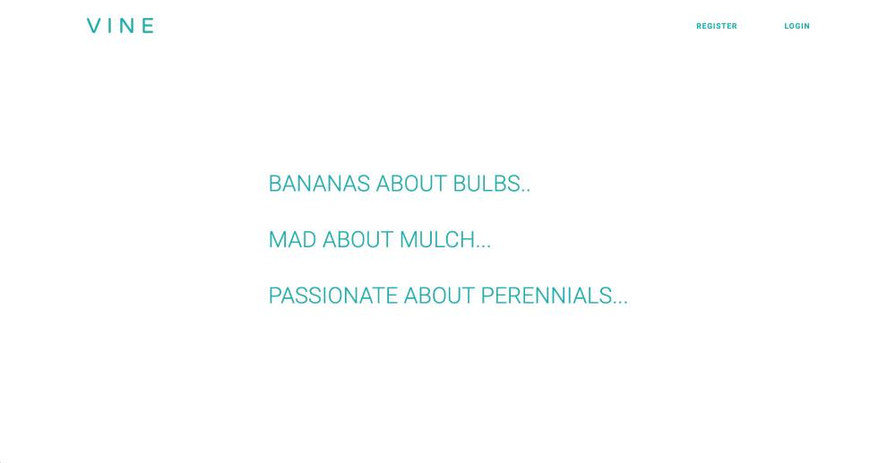  

<li>If a user does not have an account they would click the register button and are taken to register page where they need to provide a username, email, password, password confirmation, a short bio and profile photo. If a user leaves any of the fields blank and tries to submit the form they will receive an error message underneath the field that has not been filled in correctly. If the registration was successful the user is pushed to the login page.</li>

# 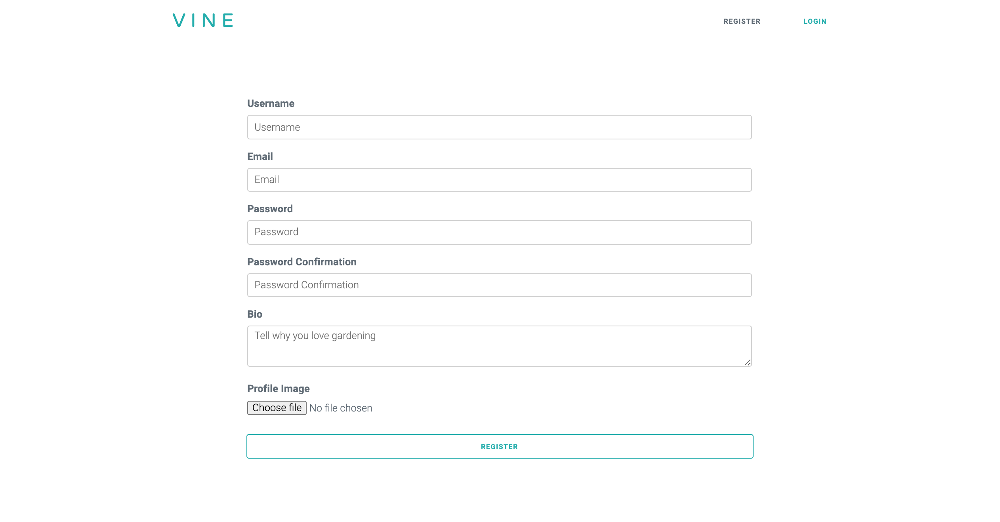  

<li>When the user lands on the login page they will need to provide the email and password they used in the registration process. If they user provides incorrect details or an empty field and tries to submit the form they will receive an error. If the correct details are provided the user will be taken to the feed page. </li>

# 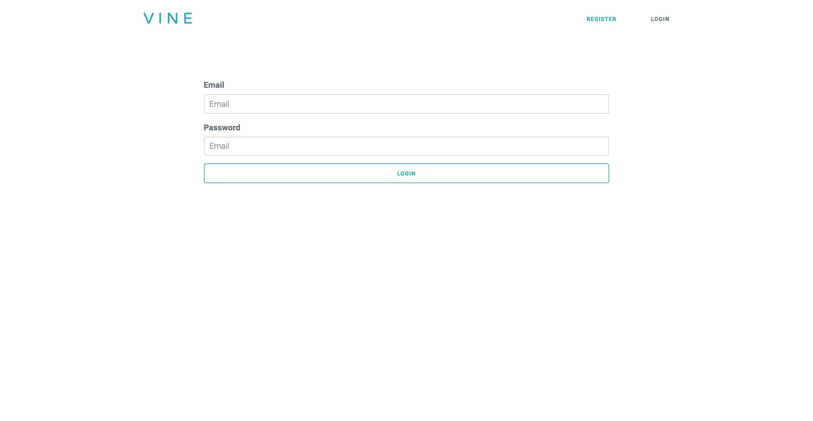  

<li>When the user lands on the feed page they can firstly scroll through posts and comments made by other users of the site. If a user wants to comment on a post they use the comment field at the bottom of each post. Here they can also like a users post. Next a user can create there own post my navigating to the top of the page and began by entering text in the text field, ‘Write your post here….’.  The user then chooses an image to accompany the post and clicks create post. The users post will then appear at the top of the posts on the feed page. If a user clicks on  another users profile photo they will be taken to the said users profile.</li>

# 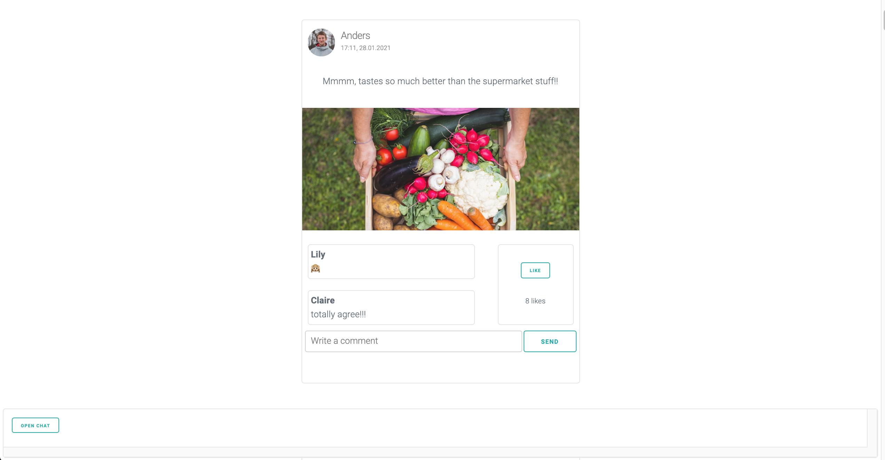 
#  

<li>Once landing on another users profile the user will be able to see a username, email, date the user joined, bio, friends of the user and lastly is a button that will let the user add the user who’s profile they are own as a friend.</li>

# 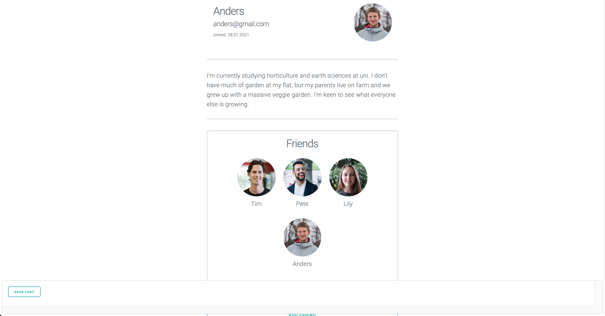 

<li>At this point a user can navigate to their own profile by clicking the ‘profile’ button in the nav bar. The profile profile view is only visible to the user who is logged in to the site. Here the user can see their username, email, date they joined, bio, friends list, posts they have created, posts they have liked and comments they have made. At the bottom of the page is a delete profile button, if a user clicks the delete button there profile will be deleted and they will be pushed to the homepage.</li>

# 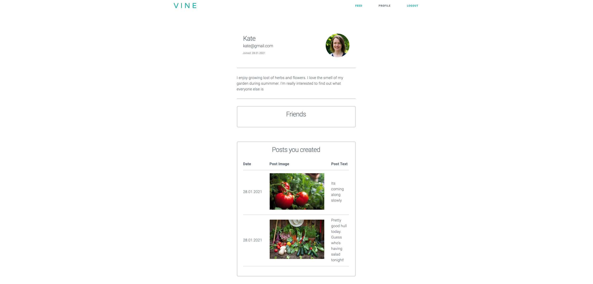 
# 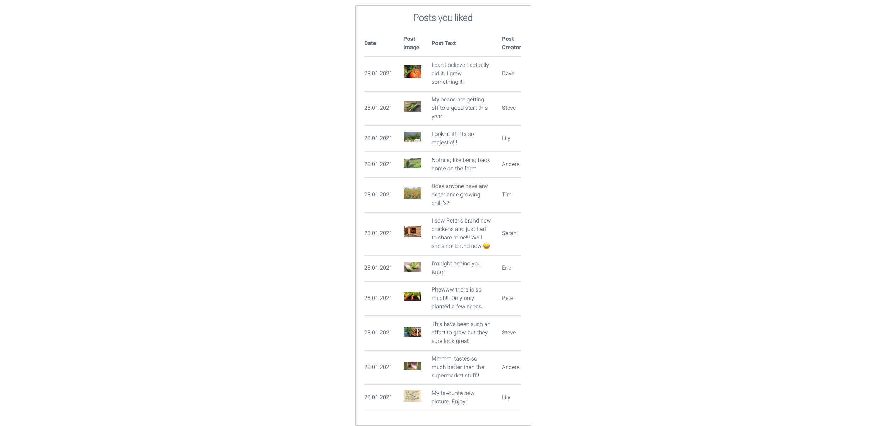 
# 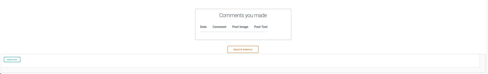 

<li>A user also has the option to directly message any other users of the site. This can be done by clicking the open chat button at the bottom left of the page. From here the user selects the person they would like to chat with from the select menu and a chat box will appear to the right of the select menu. The user can then enter text in the message text field and click send. A user can create as many chats as they would like but they cannot start a chat with own profile. If a user started the chat they are able to delete the chat by clicking the delete button located at the button of each chat box.</li>

# 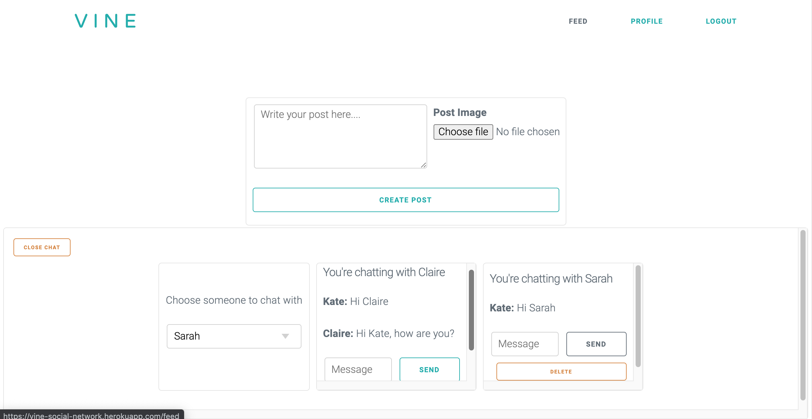 

<li>Lastly a user can logout of there profile by clicking the logout button located in the navigation bar and the user will be pushed to the home page.</li>

<h2>Creating the app</h2>

Once settled on a well rounded concept that would be achievable in the time frame but at the same time push me out of my comfort zone. I began the planning phase. Normally I would create wireframes and mind maps to help plan the flow and look of the website. However this time I took a different approach. I knew that I wanted to use a new CSS framework called, ‘Milligram’ but at this point hadn’t experimented with the framework. So instead of using wireframes and mind maps to plan the front-end of the website I built a dummy react application of how I would potentially like the site to look. I used this as the starting point when I built the front end. Below is a screenshot of the profile page from the dummy application.

# 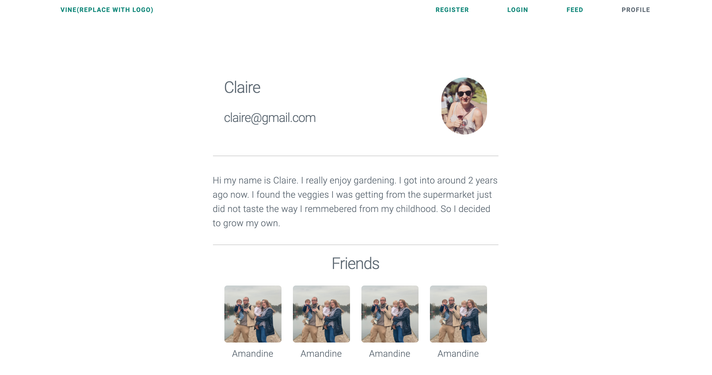 

To plan the back end of the website I created an ERD diagram to plan the tables I would need in my database and have a visual representation of what relationships those tables would need for the site to function correctly.

# 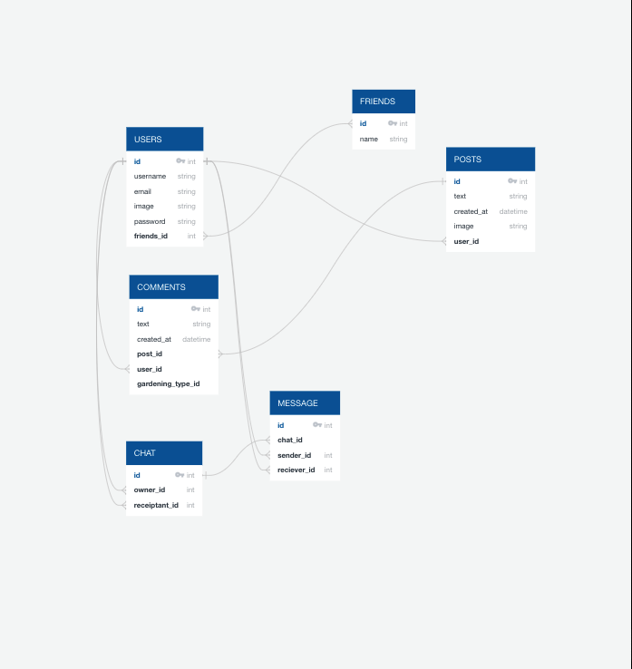 

With a clear map of how the backend would function I began creating my app/models, urls and serializers in Django using Django Framework and a Postgre SQL database to serve the data. Starting with my user apps, then moving to my post app, comment app, chat app and lastly the message app. As I created each app I would test the urls assocaited with each app by making API requests in insomnia to test the response and error handling of each url.

Once all the urls were working correctly I moved on to creating the font end in React. I began by creating the navbar and routing for the website, then moved on to the register page, from there to the login page, after that the feed page and then the user profiles. At this point I had reached my phase 1 MVP and was able to move onto Phase 2. Phase 2 was implementing the chat and messaging functionality and refining the styling on the front end.

For the styling of the website I used Milligram CSS framework to style the forms and buttons. For the remaining styling I used Flexbox and Sass.

<h2>Challenges</h3>

This was the first project where I had used python as a backend programming language. At the start of the project I found it a bit challenging switching between using python on the back-end and JavaScript on the front but found my groove after day 2.

Another aspect I found challenging was how to display the chat function on the front-end so a user could send a message to another user and the user that received the message could reply to the received message. This was challenging because the user who sent the first message would be the creator of the chat and the chat would be stored in the ‘createdChats’ array on the user object. However the user who received the chat would have the chat stored in the ‘recievedChats’ array in there user object but this user would still need to reply to the initial chat that was stored in the ‘createdChats’ array of the user who sent the first message.

<h2>Wins</h2>

The biggest win for me was definitely the implementation of the chat function. I found designing the models, ulrs and serializers really straightforward and it seemed to be running perfectly when I ran tests in insomnia. But when it came to implementing the feature on the front end it was a lot more challenging and I ran into a several problems I hadn’t accounted for. At one point I wasn’t sure I would be work it out. To get over this hurdle felt like a huge accomplishment and a nice progression in my skills as a developer.

The first piece of code below is the from my, ‘CreateadMessage’ component and the second piece of code is from my ‘RecievedMessage’ component. When a user sends a message it is stored in the chat that was created by the user who sent the first message. When a user receives a message they reply to the the same chat that was started by the user who sent the first message. In turn creating a seamless experience for a user.

# 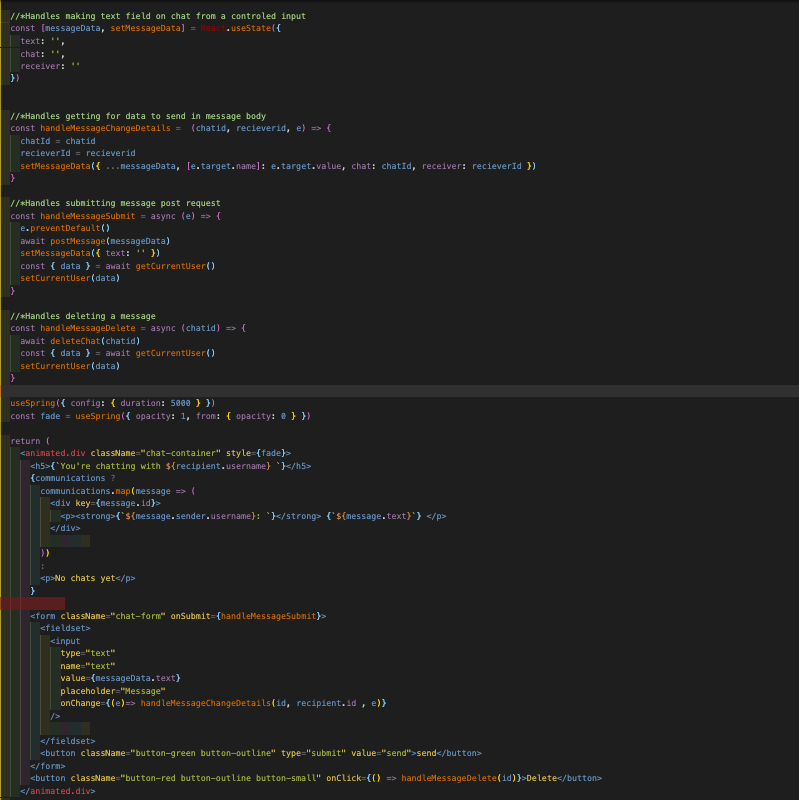 
# 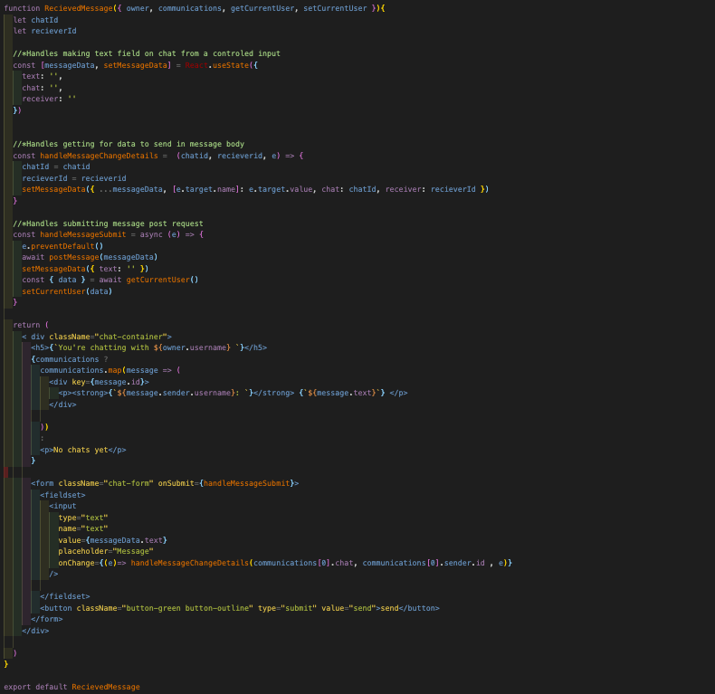 

<h2>Future Features</h2>

If I had more time I would like to implement a poll feature. Where a user can pose a yes or no question and other users of the site could vote use yes or no to the question and have the results of the poll reflected on the feed page.
